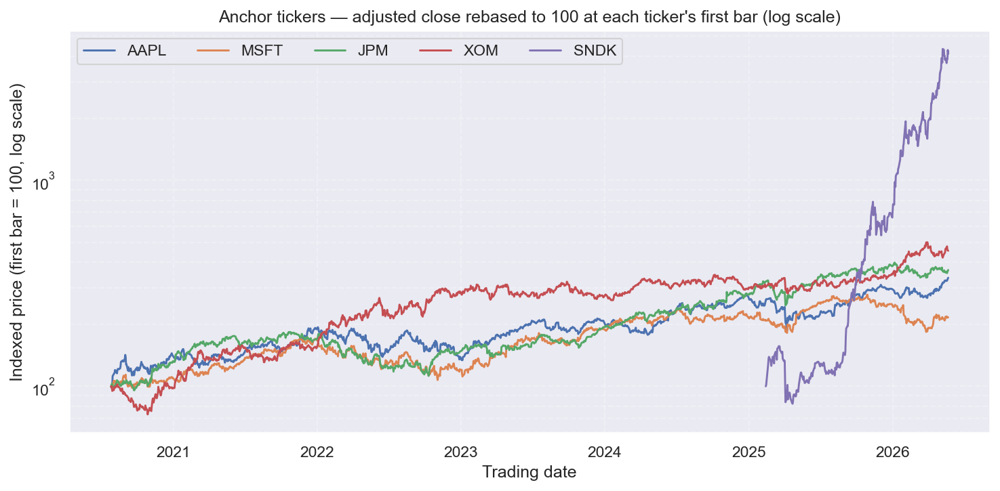

\newpage

# Executive Summary

The **Stock Portfolio Recommender** is a beginner-friendly tool that turns a short
questionnaire about an investor (experience, time horizon, loss tolerance, monthly
budget, sector preferences) into a small, diversified portfolio of 5–10 stocks
picked from the S&P 500, accompanied by the risk metrics that justify each pick.

This report documents how we acquired the dataset, what it contains, the
exploratory analysis we ran, the data-quality issues and biases we found, the
pre-processing that turns the raw bars into an ML-ready table, the modelling, and
the conclusions. All figures and statistics are reproduced directly from the local
dataset by `reports/make_figures.py`.

> **Disclaimer:** This project is decision support for a beginner investor, **not**
> financial advice.

\newpage

# 1. Introduction

## 1.1 Context and motivation

A first-time investor who wants to hold individual stocks faces an awkward gap in
the tooling market. On one side sit broker advisory products that hide their logic
behind a paywall and a risk questionnaire that collapses every user into one of
three buckets ("aggressive / moderate / conservative"). On the other side sit free
online screeners that expose hundreds of filters but assume the user already speaks
the language of finance — beta, drawdown, Sharpe ratio — and offer no opinion about
where to start. The result is that the beginner either pays for an opaque
recommendation or is left to sort ~500 tickers alone. Our project targets exactly
this gap: a transparent, data-driven recommender that explains *why* each stock was
picked, in terms a beginner can follow.

## 1.2 Problem statement

Retail investors who want to pick individual stocks usually have to choose between
paying for a broker's recommendation or scrolling through hundreds of tickers in an
online screener with no idea where to begin. We frame the recommendation problem in
three stages:

1. **Clustering** — group the stock universe by historical risk/return profile.
2. **Return ranking** — train a regression model to rank stocks *within* each cluster.
3. **Recommendation** — map the user's questionnaire to a target risk profile, pick the
   relevant clusters, and return top-*N* stocks per cluster, with a sector-concentration cap.

> **Note on delivery vs. plan.** This original 3-stage framing (and the
> 12-month horizon below) evolved once modelling started, and both
> changes were deliberate, evidence-based decisions rather than scope
> creep: no unsupervised clustering stage was built — it was replaced with a
> per-asset classifier and a full-universe regression recommender — and the
> shipped horizon was shortened from 12 months to **63 trading days**
> (≈ 1 quarter). A genuine 12-month-ahead target needs years of
> *non-overlapping* forward windows to validate reliably, and with only
> 5–6 years of usable history per ticker — shorter still for
> recent entrants — a 12-month label would have left too few independent
> out-of-sample observations to trust. 63 days keeps three to four times more
> independent test windows in the same history, at the cost of a shorter
> look-ahead — a trade the team judged worth making for a methodologically
> honest result over an ambitious but unverifiable one. The Modeling section
> explains what was built instead and is the up-to-date statement of what the
> app actually does.

## 1.3 Scope and assumptions

- **Universe:** S&P 500 only (503 tickers in the current extract). DAX 40 deferred to a stretch goal.
- **Granularity:** daily OHLCV bars; ≈ 5–6 years of history on the Alpaca free IEX feed.
- **Currency:** USD only.
- **Horizon:** the recommender targets a 12-month-ahead expected return.
- **Out of scope:** intraday trading, options, fundamentals (P/E, EPS, dividend yield,
  any company financial statements), live execution, tax considerations.

## 1.4 Stakeholders and team

- **Team:** Gabriel Marchesan Almeida, Paweł Flak, Marcus Schürstedt.
- **Mentor:** Paul Grolier (Liora).
- **Program Manager:** Nicole Lucerni (Liora).
- **Cohort Leader:** Vincent Lalanne (Liora).
- **Audience for this report:** Liora jury (technical review, oral defense).

\newpage

# 2. Data Sources and Acquisition

## 2.1 Universe selection

We use the **S&P 500** as the initial universe — the 503 constituents (a handful of
companies carry two share classes) of the headline US large-cap index. The choice is
deliberate for a first iteration: a single currency (USD), a single primary market
and exchange calendar, and homogeneous accounting and disclosure standards remove a
large class of cross-market confounders before any modelling begins. The natural
alternative, the German **DAX 40**, was dropped from the working scope because our
selected data provider does not cover it on the free tier; the methodology is
market-agnostic, so DAX 40 can be re-added later through a second provider as a
stretch goal.

The constituent list is scraped from the Wikipedia "List of S&P 500 companies" page,
which also supplies each company's GICS sector and sub-industry. We acknowledge the
**survivorship bias** this introduces — the list reflects *today's* members, not the
historical index — and discuss mitigation below.

## 2.2 Data providers evaluated

| Provider | Role  | Status                                    |
| -------- | ----- | ----------------------------------------- |
| yfinance | OHLCV | **Rejected**                              |
| Alpaca   | OHLCV | **Selected** (mentor-approved) |

The project is intentionally **price-only** — no fundamentals, no risk-free rate, no offline
backup feed. Every feature engineered downstream (returns, volatility, beta, drawdown,
momentum, Sharpe with `rf = 0`) is derived from Alpaca OHLCV.

## 2.3 Why we abandoned yfinance (documented failed approach)

Our first data layer used **yfinance**, the open-source Python wrapper around an
unofficial Yahoo Finance endpoint. It let us stand up `fetch_data.py` quickly and
pull both S&P 500 and DAX 40 history, so we could prioritise the ML work over data
plumbing. In review, two problems made it unsuitable as the project's foundation:

- **Reliability / governance.** yfinance scrapes an undocumented endpoint with no
  service guarantee — it is fragile to rate limits, IP bans and silent schema
  changes, and it is not an accepted data source for back-testing platforms such as
  QuantConnect, which our recommendation engine will likely need later.
- **Validation.** Paweł built a side-by-side comparison (`data provider choose.html`)
  of Yahoo Finance vs. Alpaca on overlapping (ticker, date) pairs and found
  **≈ 99.5 % agreement** (median absolute relative difference ≈ 0.000 %). The worst
  tail of disagreements traced to split / listing differences rather than data
  corruption — i.e. the two feeds agree on the underlying prices, but Alpaca is the
  better-governed source of the two.

We therefore migrated to **Alpaca** (2026-05-21 → 2026-05-24): an officially
supported REST API with validated fields, a batched bars endpoint and a first-party
SDK (`alpaca-py`). The one real cost of the switch is coverage — Alpaca's free tier
does **not** include the DAX 40 — which is the direct reason for the universe
reduction. Paul approved Alpaca at the mentor meeting. Per his
guidance, this migration is recorded here as one of the **failed approaches** the
final report must document.

## 2.4 Alpaca free IEX feed — capabilities and limits

- **Feed:** IEX (≈ 2–3 % of US consolidated volume); acceptable for **daily**
  aggregates, but IEX volume understates true market activity — a limitation we
  carry forward, not a defect.
- **History depth:** in our extract the data spans **2017-11-15 → 2026-05-22**, but
  coverage is **not uniform** — most symbols only have continuous daily bars from
  mid-2020 onward on the free feed (SIP, the consolidated feed with deeper history,
  is paid).
- **Per-symbol caveat:** start dates differ by symbol. New entrants — `SNDK`
  (320 trading days), `PSKY` (200) and `Q` (139) — have well under two years of
  history. The per-ticker availability map is given below.
- **Adjustments:** bars are requested with `adjustment='all'`, so splits and
  dividends are folded into `adj_close`, the column we use for all return work.

## 2.5 Acquisition pipeline (`fetch_data.py`)

Acquisition is a single reproducible CLI, `fetch_data.py`, built on `alpaca-py`. It
reads the scraped ticker list, then for each batch of symbols requests **two**
passes from Alpaca's daily bars endpoint — `adjustment='raw'` for the unmodified
OHLCV and `adjustment='all'` for the adjusted close — and merges them on
`(date, ticker)`. Key flags: `--years` (history window, default 10), `--batch-size`
(symbols per request, default 1) and `--limit` (cap the ticker count for smoke
tests). Failed symbols are retried individually and any survivors are written to
`failed_tickers.csv`; the merged frame is de-duplicated on `(date, ticker)` and
sorted before being written to `data/`.

The canonical run (**2026-05-24**) produced **503 / 503 tickers with 0 failures and
726,018 price rows**, materialised as `prices_long.csv` (long format),
`prices_close_wide.csv` (a date × ticker pivot of `adj_close`) and `tickers.csv`
(metadata). These files are audited in the next section.

\newpage

# 3. Data Audit

The full automated audit lives in `DATA_AUDIT.md`; this section summarises it. All
counts below were re-verified against the local CSVs while preparing this report.

## 3.1 Datasets and schemas

\footnotesize

| File                              | Rows    | Columns                          | Notes                         |
| --------------------------------- | ------- | -------------------------------- | ----------------------------- |
| `tickers.csv`                     | 503     | ticker, name, sector, industry, index, country | Wikipedia → enriched          |
| `prices_long.csv`                 | 726,018 | ticker, date, OHLCV, adj\_close | Long format for feature eng. |
| `prices_close_wide.csv`           | 1,723 × 503 | date × ticker (adj\_close)   | Wide format for correlations |
| `failed_tickers.csv`              | 0       | ticker, reason                   | Empty after the last run     |

\normalsize

The price panel is **unbalanced**: 503 distinct symbols across 1,723 trading dates,
but not every symbol trades on every date (listing-date heterogeneity).

## 3.2 Data dictionary

**`tickers.csv` (metadata, 503 rows, 0 % missing):**

| Column     | Type   | Cat./Quant. | Notes |
| ---------- | ------ | ----------- | ----- |
| `ticker`   | string | categorical (503) | Primary key; Alpaca dot notation for share classes (`BRK.B`, `BF.B`). |
| `name`     | string | categorical (503) | Display only; not a model feature. |
| `sector`   | string | categorical (11)  | GICS sector; drives the ≤ 30 % sector cap. |
| `industry` | string | categorical (127) | GICS sub-industry; high cardinality → target/grouped encoding. |
| `index`    | string | categorical (1)   | Constant `SP500`; kept for future DAX 40 schema compatibility. |
| `country`  | string | categorical (1)   | Constant `US`. |

**`prices_long.csv` (daily OHLCV, 726,018 rows, 0 % missing):** `date` (1,723
distinct sessions, no weekends), `ticker` (FK → `tickers.csv`), `open` / `high` /
`low` / `close` (raw, unadjusted), `adj_close` (split/dividend-adjusted — **use this
for returns**) and `volume` (IEX shares). Raw `close` has mean 202.42, median 116.77
and max 9,933.51 USD; `adj_close` differs from `close` on **82.1 %** of rows
(mean absolute difference ≈ 33.1 USD), exactly as expected after corporate actions.

## 3.3 Completeness and missingness

There is **no random missingness**: every column is 0.0 % missing, there are **0**
duplicate `(date, ticker)` pairs, **0** OHLC-logic violations (`high < low`, prices
outside the open/close range) and **0** weekend rows. The metadata↔price join is a
100 % match on `ticker`.

What the dataset *does* have is **structural** missingness — gaps where a symbol was
not yet listed. History length per symbol ranges from **139 to 1,716 trading days**
(median **1,461**, mean 1,443). About 484 symbols begin on or after 2020-07-01 (IEX
free-feed coverage), a few reach back to 2017, and three recent S&P 500 entrants are
much shorter: `SNDK` (320 d), `PSKY` (200 d) and `Q` (139 d). Feature windows must
therefore be aligned per symbol against each ticker's first valid date — treating the
panel as balanced would silently fabricate pre-listing history.

\newpage

# 4. Exploratory Data Analysis

This section satisfies the Liora **Step 1** requirement: *"at least 5 relevant
visualizations, each with a precise commentary providing a business opinion and
validated by data manipulation or a statistical test."* We deliver **six** — the
same six approved by the mentor. Each figure below is regenerated from
the local data by `reports/make_figures.py`, which also computes the supporting
statistics referenced in the commentary.

## 4.1 Number of stocks per sector

{ width=80% }

**What it shows.** The 503 constituents split across 11 GICS sectors, from
Industrials (79), Financials (76) and Information Technology (73) at the top down to
Communication Services (23) and Energy (21).

**Business commentary.** The index is not balanced by sector, so a naïve
"pick the best names" recommender would drift heavily into Industrials / Financials /
Tech. This is the direct justification for the **≤ 30 % per-sector cap** at
recommendation time — and that cap is most likely to bind for tech-tilted
(aggressive) profiles.

## 4.2 Mean daily volume per stock

{ width=62% }

**What it shows.** One mean-daily-volume value per stock (503 points). The median is
≈ **104k shares/day**, but the distribution is strongly right-skewed, from ≈ 1.7k up
to ≈ 1.6M shares/day.

**Business commentary.** Liquidity spans three orders of magnitude. The recommender
should down-weight or flag the thinnest names — for a beginner, an illiquid pick is a
hidden cost (wide spreads, hard to exit) regardless of its risk/return profile.

## 4.3 Distribution of daily returns

{ width=85% }

**What it shows.** Daily returns are sharply peaked at ≈ 0 % with thin but very long
tails reaching beyond ±50 %.

**Business commentary.** Day-to-day, most stocks barely move; the action lives in the
tails. This validates the two-stage design — **cluster** by risk/return profile, then
**rank within** clusters — rather than trying to predict raw daily direction, which is
near-zero-centred noise.

## 4.4 Price line plot (anchor tickers)

{ width=85% }

**What it shows.** Five anchor tickers rebased to 100 at their first available bar.
Four established names (AAPL, MSFT, JPM, XOM) start on 2020-07-27 with ≈ 1,461–1,464
bars each; **SNDK starts only on 2025-02-13** with 320 bars and then rises steeply.

**Business commentary.** This is the survivorship-/ragged-history problem made
visible: the universe is not a uniform-quality panel, and a recent entrant on a short,
explosive run can dominate any naïve ranking. It motivates a **minimum-history rule**
for the clustering universe.

## 4.5 Correlation heatmap (top traded tickers)

{ width=72% }

**What it shows.** The return correlation matrix for the 10 most-traded names
(NVDA, INTC, F, BAC, AAPL, T, WBD, PFE, KVUE, PLTR).

**Business commentary.** Average pairwise correlation is **low and positive
(≈ 0.17)** — even among megacaps there is real diversification to harvest. This is the
quantitative basis for picking *across* low-correlation clusters rather than loading
one theme.

## 4.6 Risk vs. Return scatter

{ width=85% }

**What it shows.** One point per stock — annualised volatility (x) vs. annualised
return (y). The cloud trends up-and-to-the-right around the medians (vol ≈ 29.7 %,
return ≈ 16.1 %). **SNDK sits far in the top-right corner (≈ 98 % risk, ≈ 343 %
return)** as an extreme outlier.

**Business commentary.** Higher return comes bundled with higher risk — exactly the
trade-off the questionnaire must navigate. This plot is the visual map onto which the
user's risk tolerance is projected to choose target clusters.

\newpage

# 5. Identified Issues and Biases

## 5.1 Survivorship bias

The universe is **today's** S&P 500 (a Wikipedia snapshot at download time), so it is
biased toward winners — companies that were demoted or went bankrupt are absent, which
inflates the apparent average return of "the index". Any back-tested number in
Rendering 2 must be read with this caveat. Mitigation roadmap (per the mentor):
if time permits, reconstruct a historical-constituent panel from dated
Wikipedia revisions; otherwise we state the residual bias explicitly as a threat to
validity.

## 5.2 Outliers — the SNDK case (documented failed-pure-drop)

`SNDK` surfaces on the risk/return scatter at **≈ 343 % annualised return and
≈ 98 % annualised volatility**, but it has only **320 trading days** of history
(first bar 2025-02-13). The instinct is to drop it. Per the mentor we do
**not** drop outliers blindly: we plan a **with-vs.-without-outlier** modelling
comparison and report the measured impact. SNDK is the standing example of this class
of recent, high-variance entrants.

## 5.3 Ragged histories (new S&P 500 entrants)

The team's early assumption that all 503 tickers share uniform data quality was
**wrong** (per the mentor). History length runs from 139 to 1,716 days,
and three names — `SNDK` (320 d), `PSKY` (200 d), `Q` (139 d) — fall well under two
years. We will impose a **minimum-history cutoff** (candidate: ≥ 3 years, ≈ 756 trading
days) for the clustering universe so that volatility / beta / drawdown features are
estimated on enough data to be meaningful; short-history names can still be scored by
the ranking model but are flagged.

## 5.4 Single-market / single-currency scope

Dropping the DAX 40 narrows every empirical conclusion to **USD equities**. The
methodology generalises to other markets, but the fitted clusters and back-tested
numbers do not — we present them as US-large-cap results, not universal ones.

## 5.5 Look-ahead leakage

Because the metadata (sector/industry) reflects *current* GICS labels and the
adjusted prices fold in *all* historical corporate actions, careless feature
construction can leak future information into the past. Our discipline: features at
time *t* use only data available at *t*, and cross-validation is **`TimeSeriesSplit`,
never random k-fold**.

\newpage

# 6. Data Manipulation Performed during EDA

The manipulations below are the ones run **during exploration**; the heavier
pre-processing pipeline is the subject of the next section. They are implemented in `src/data_loader.py` and
`src/plots.py` and are fully reproducible from the raw CSVs via
`reports/make_figures.py`:

- **Adjusted-close return series.** `data_loader.load_prices()` sorts by
  `(ticker, date)` and computes `daily_return = adj_close.pct_change()` *within each
  ticker* (the `groupby` prevents returns from bleeding across symbol boundaries).
- **Per-ticker aggregation.** Mean daily volume per stock and annualised
  return / volatility per stock (`mean·252`, `std·√252`) are `groupby('ticker')`
  reductions on the long frame.
- **Wide pivot for correlations.** We pivot `(date × ticker)` on `daily_return`
  for the most-traded names and drops dates with any missing member before computing
  the correlation matrix — so the matrix is built on a common 765-day window.
- **Metadata join.** Sector/industry are joined from `tickers.csv` on `ticker` for the
  sector plot and for the future sector-cap logic.

Each figure in this section is produced by exactly one of these paths, which keeps the report
reproducible end-to-end from the three source CSVs.

\newpage

# 7. Pre-processing and Feature Engineering

This section satisfies the Liora **Step 2** requirement. It defines the ML-ready
end-state and the cleaning / encoding / feature plan; the engineered table is built
and consumed in Rendering 2.

## 7.1 End-state definition

The dataset emerging from this section must be **ML-ready**:

- Fully numerical (no string columns).
- No NaNs (or NaNs deliberately preserved with a documented downstream handler).
- One row per (ticker, date) for time-series modelling, plus a wide per-ticker
  feature matrix for clustering.
- Split-ready: indices that the modelling code can pass directly to
  `TimeSeriesSplit`.

## 7.2 Cleaning rules

Driven by the findings above:

- **Fix the `low = 0` print** (AT&T, 2021-06-11): the other OHLC fields that day are
  ≈ 29.35, so the row is repaired (or dropped) rather than left to poison volatility
  features.
- **Flag the 60 raw daily moves > ±50 %** for review; most are split artefacts that
  `adj_close` already handles, so returns are built from `adj_close`, not `close`.
- **De-duplicate** `(ticker, date)` rows (already 0 in the current pull, enforced as a
  guard) and track a stable `ticker_id` so renames / class changes don't fragment a
  series.

## 7.3 Missing-value strategy (per column)

| Column                  | Missingness pattern | Strategy                                                         |
| ----------------------- | ------------------- | ---------------------------------------------------------------- |
| `open` / `high` / `low` / `close` | Trading halts | Forward-fill within ticker, max 3 days; else drop                |
| `volume`                | Holiday / zero-volume bars | `0` + indicator column                                    |
| `adj_close`             | Pre-listing bars    | Left blank; ticker dropped if first-listing < min-history cutoff |
| `sector` / `industry`   | Unmapped tickers    | Manual fix via override CSV                                      |

Because the only missingness is **structural** (pre-listing gaps), the key rule
is the per-ticker window alignment plus the min-history cutoff above — not generic
imputation.

## 7.4 Categorical encoding

Per the mentor, encoding is done **explicitly** even for models that can
ingest categories natively:

| Variable          | Cardinality | Tree-based models | Linear models |
| ----------------- | ----------- | ----------------- | ------------- |
| `sector` (11)     | low         | label encoding    | one-hot       |
| `industry` (127)  | high        | target encoding (fit inside CV folds) | hashing / grouped |
| `index` (1)       | trivial     | drop              | drop          |

Target encoding for `industry` is fit **inside** each CV fold to avoid leakage.

## 7.5 Derived features

Planned feature set (computed per ticker, windows in trading days), all derived from
`adj_close` / `volume`:

- `ret_1d`, `ret_5d`, `ret_21d`, `ret_252d` — log-returns over increasing horizons.
- `vol_21d`, `vol_252d` — rolling annualised volatility.
- `sharpe_252d` — annualised, computed with `rf = 0` (no external risk-free feed in scope).
- `beta_252d` — vs. an equal-weight market proxy built from the universe.
- `max_drawdown_252d` — worst peak-to-trough over the trailing year.
- `momentum_12_1` — 12-month return excluding the most recent month.
- `amihud_illiq` — illiquidity proxy (|return| / dollar volume), on the log scale.

## 7.6 Outlier policy (with-vs.-without comparison)

Per the mentor, we **do not drop outliers blindly**. Instead, we will:

1. Define an outlier flag (e.g. `|z-score| > 4` on annualised return).
2. Train all downstream models **twice** — once with the flagged rows, once without.
3. Report Δ-metric (R², RMSE, ranking-IC) and let the data decide.

This is the standing protocol for the **SNDK-class** tickers introduced earlier.

## 7.7 Train / validation / test split

A strictly **time-based** split (no shuffling): train on the earliest window,
validate on the next, test on the most recent — with `TimeSeriesSplit` (5 folds)
*inside* the training period and never random k-fold, so no future bar ever informs a
past prediction. Exact cut dates are fixed in Rendering 2 once the feature
table is materialised.

\newpage

# 8. Modeling

> Two modeling tracks were built against the same S\&P 500 universe: a
> per-asset intraday classifier, and a full-universe regression recommender
> now wired to the risk questionnaire.

## 8.1 Two modeling tracks, explored in parallel

The team pursued two complementary tracks rather than a single pipeline:

- **Track A — Full-universe regression recommender.** A regression-ranking
  approach across the full 503-ticker universe, targeting a 63-trading-day
  forward return, feeding a profile-based portfolio layer with a 30% sector
  cap.
- **Track B — Per-asset intraday classifier.** A supervised binary classifier
  on 1-hour bars with Triple-Barrier labelling, tuned with Optuna, sized with
  fractional Kelly, built on a 10-asset subset and evaluated out-of-sample.

Neither implements the unsupervised clustering originally proposed; both
replaced it with a supervised or rule-based layer. Both also trade the
original **12-month-ahead** target for shorter horizons — Track A ranks
stocks 63 trading days out, Track B is intraday — because with only
5–6 years of usable history per ticker, a 12-month label leaves too
few independent forward windows to validate; the shorter horizons keep
several times more non-overlapping test windows in the same span, trading
look-ahead length for a trustworthy out-of-sample sample size.

## 8.2 Track A — Full-universe regression recommender

**Dataset.** The full six-year Alpaca IEX window available at run time: 503
S&P 500 tickers, 2020-07-27 → 2026-06-08 (5.86 years, 1,474 trading dates),
729,313 price rows, 0 missing OHLCV/adjusted-close values. Shortest-history
constituents: `SNDK`, `PSKY`, `Q`, plus newer entrants `FDXF`, `GEV`, `SOLV`,
`VLTO`, `KVUE`, `GEHC` and `WBD`.

Each row is a backward-looking feature window (e.g. `ret_60d`,
`volatility_60d`, `drawdown_252d`) paired with a forward target computed only
once the outcome is known:

{ width=85% }

{ width=85% }

**Target and split.** The target is `target_63d_return` — the forward return
roughly three market months out (63 trading days), ranking stocks rather than
predicting an exact price. A fixed time-based split (train 2020-10-20 →
2024-12-31, test 2025-01-02 → 2026-03-09) compares five candidate models.
*Naming note:* "Random Forest" here is a **different, independently trained
model** from the RandomForest bagging baseline — that one is a
Track B classifier that underperforms XGBoost; this one is a Track A
regressor that turns out to be the practical winner of its own comparison.

{ width=85% }

| Model                              | MAE   | RMSE  | Spearman rank corr. | Top-5 avg. actual return |
| ----------------------------------- | ----: | ----: | -------------------: | ------------------------: |
| Ridge (baseline)                   | 0.134 | 0.203 | **0.164**             | **0.343**                 |
| Random Forest                      | 0.135 | 0.207 | 0.083                 | 0.216                      |
| Random Forest, no `history_days`   | 0.135 | 0.205 | 0.110                 | 0.301                      |
| XGBoost, no `history_days`         | 0.137 | 0.210 | 0.060                 | 0.179                      |
| ROCm PyTorch MLP                   | 0.342 | 0.430 | −0.020                | 0.179                      |

`history_days` — a feature suspected of leaking listing-recency information —
is deliberately dropped from the two "no `history_days`" variants and from the
production candidate.

{ width=85% }

{ width=85% }

**Walk-forward validation.** The no-`history_days` Random Forest, retrained on
expanding history across 13 rolling 63-day folds, beat the universe average
return on **9 of 13 folds** (mean top-5 return 18.2% vs. mean universe return
4.7%) — a more realistic view than the single fixed split.

**Portfolio construction.** Rankings from the no-`history_days` Random Forest
feed a rule-based portfolio layer: 10 stocks, equal-weighted, **≤30% per
sector**.

{ width=85% }

| Profile      | Expected 63-day return | Avg. 60-day volatility | Sectors | Max sector weight |
| ------------ | -----------------------: | ------------------------: | ------: | ------------------: |
| Conservative | 6.8%                     | 28.4%                     | 6       | 30%                  |
| Balanced     | 8.4%                     | 40.6%                     | 5       | 30%                  |
| Aggressive   | 12.7%                    | 53.5%                     | 5       | 30%                  |

**Wired to the risk questionnaire.** The 9-question risk-assessment form now
prefills this portfolio layer's controls — risk profile, volatility cap,
portfolio size, ranking objective, sector cap and excluded sectors — directly
from the user's answers.

**Honest headline.** Ridge, the simplest model, had the best rank correlation
and top-5 actual return on the fixed split; the no-`history_days` Random
Forest is used in the running app because it balances performance,
explainability and walk-forward robustness better than the alternatives — not
because it topped every metric. Neither XGBoost nor the ROCm PyTorch MLP beat
the simpler baselines on this universe.

{ width=85% }

\newpage

## 8.3 Problem framing and the learning target

**From price bars to a supervised label (Triple-Barrier).** Every eligible 1h
bar `t0` is a candidate trade. Its side is taken from 1h momentum,
`direction = sign(log_return_5[t0])` (a zero-momentum bar is skipped). The
trade is simulated under the **ATR Triple-Barrier** contract
(`TripleBarrier.ATR.v1`, implemented in `pipeline.py: generate_candidate_events`,
`simulate_trade`): entry fills at the next bar open,
`entry = open[t0+1] · (1 + side · slippage)`; barriers are symmetric,
half-width `= ATR14[t0] · 1.0` (target `= entry + side · width`, stop
`= entry − side · width`); a **24-bar time barrier** closes the trade at a
scheduled close (`scheduled_moc_close`) if neither side is touched; commission
(1 bp) and slippage (2 bp) are charged. The label `Y = 1` if the net-of-cost
return is positive, else `0` — this is **binary classification**, and because
positive rates run ≈ 0.47–0.52 per asset, **AUC-PR** (not accuracy) is the
honest metric.

**Feature space.** The model sees **56 numeric features**, namespaced by
timeframe and concatenated in a deterministic order (`config/feature_namespaces.json`):

| Namespace  | IDs     | Count | Content                                            |
| ---------- | ------- | ----- | --------------------------------------------------- |
| `1h`       | 1–17    | 17    | 1-hour indicators (the decision clock)               |
| `1d`       | 101–117 | 17    | Daily indicators, projected as-of the 1h decision    |
| `1w`       | 201–217 | 17    | Weekly indicators, projected as-of the 1h decision   |
| `multi_tf` | 901–905 | 5     | Cross-timeframe alignment / spread features          |

Families repeat per timeframe: **returns** (`log_return_1/5/20`), **trend**
(`dist_to_sma_20/50`, `sma_20_sma_50_ratio`, `close_z_score_20`), **momentum**
(`rsi_14`, MACD line/signal/hist), **volatility** (`atr_pct_14`,
`realized_volatility_20`, Bollinger %b + bandwidth), **volume**
(`volume_z_score_20`) and the `direction` sign; the five `multi_tf` features
are `momentum_alignment_multi`, `rsi_spread_1h_1d`, `volatility_ratio_1h_1d`,
`macd_hist_alignment_multi` and `price_vs_sma_alignment_multi`. All features
are numeric — no categorical encoding is needed, unlike the plan —
and XGBoost's native missing-value handling absorbs the NaNs that
daily/weekly projections legitimately produce early in a series.

**Leakage control.** The series is split strictly by time
(`config/pipeline_parameters.json`): warmup (2016-01-04 → 2016-10-14), train
(2016-10-17 → 2023-12-29) and a never-touched **OOS window**
(2024-01-02 → 2026-05-29). A purge step (`purge_train_setups`) drops any
training setup whose label horizon reaches into OOS, and cross-validation
inside Train (`purged_wf_folds`) uses **4 purged walk-forward folds** with a
35-bar embargo (`EMBARGO_BARS`) — never a random k-fold, consistent with the
leakage discipline. With a 24-bar horizon and a 35-bar
embargo, the combined no-peek span between a label and the next usable bar is
**59 bars**.

## 8.4 Baseline models

Two baselines frame how much the model adds: the **no-skill floor** (AUC-PR
equal to each asset's positive rate, ≈ 0.47–0.52) and an **untuned XGBoost**
with a fixed, honest first-iteration hyperparameter set (`max_depth 3, eta
0.1, subsample 0.9, colsample_bytree 0.9, min_child_weight 1.0, reg_lambda
1.0, n_estimators 100`). The untuned model
already clears the prevalence floor on most assets, and Optuna tuning
adds a further, modest lift on **10 / 10** assets — the realistic ceiling is
low (`cv_auc_pr` tops out around 0.55), which sets honest expectations for the
OOS economics.

## 8.5 Metrics, optimization and model comparison

### 8.5.1 Metrics

Training/selection metric is **AUC-PR** (`eval_metric = "aucpr"`; Optuna
direction `maximize` — more informative than ROC-AUC for a near-balanced,
economically asymmetric target). A trade fires only when the model's
probability `p ≥ THRESHOLD_ENTRY = 0.6` (`run_engine`) — a conservative gate
that trades recall for precision. OOS economic metrics (profit factor,
return %, max drawdown %, win rate %, trade count, time-in-market %) rank
strategies by `STRATEGY_OBJECTIVE`: **PF (max) → drawdown (min) →
time-in-market (min)**, with win rate informational.

### 8.5.2 Hyper-parameter optimization

XGBoost is tuned with **Optuna**: a TPE sampler (seed 42), a MedianPruner (2
warmup steps), 200 trials, maximizing the mean AUC-PR over the 4 purged
walk-forward folds (`layer7_optuna`). The search space
(`config/xgboost_optuna_search_space.json`):

| Hyper-parameter    | XGBoost name                       | Type  | Range        | Scale   |
| ------------------ | ----------------------------------- | ----- | ------------ | ------- |
| `max_depth`        | `max_depth`                         | int   | [2, 5]       | linear  |
| learning rate      | `eta`                                | float | [0.02, 0.30] | log     |
| row subsample      | `subsample`                          | float | [0.6, 1.0]   | linear  |
| column subsample   | `colsample_bytree`                   | float | [0.6, 1.0]   | linear  |
| `min_child_weight` | `min_child_weight`                   | float | [1.0, 10.0]  | linear  |
| L2 regularization  | `reg_lambda` → `lambda`              | float | [0.5, 5.0]   | linear  |
| number of trees    | `n_estimators` → `num_boost_round`   | int   | [40, 300]    | linear  |

*Example fitted model (AAPL):* `max_depth 5, eta 0.192, subsample 0.748,
colsample_bytree 0.965, min_child_weight 9.15, reg_lambda 3.88,
n_estimators 115`, giving `cv_auc_pr = 0.541`.

A second, nested optimization (`calibrate_kelly`) calibrates the **Kelly
fraction** λ on a 20-point grid in [0.05, 1.0], maximizing train out-of-fold
log-growth; live sizing is `f = clip(λ · (2p − 1), 0, KELLY_CAP = 1.0)`.
Neither optimization reads OOS.

### 8.5.3 Cross-asset OOS results

| Ticker | Trades | Win % | PF   | Return %   | Max DD % | Time-in-mkt % | CV AUC-PR |
| ------ | ------ | ----- | ---- | ---------- | -------- | ------------- | --------- |
| XOM    | 263    | 48.67 | 0.88 | −5.16      | 7.55     | 36.85         | 0.514     |
| AAPL   | 236    | 48.73 | 0.88 | −5.63      | 15.68    | 39.12         | 0.541     |
| TSLA   | 74     | 59.46 | 1.55 | **+10.36** | 4.13     | 11.02         | 0.554     |
| JPM    | 71     | 64.79 | 1.76 | +0.23      | 0.05     | 11.60         | 0.513     |
| AMZN   | 6      | 33.33 | 0.23 | −0.73      | 0.83     | 1.46          | 0.532     |
| GOOGL  | 0      | —     | —    | 0.00       | 0.00     | 0.00          | 0.533     |
| JNJ    | 0      | —     | —    | 0.00       | 0.00     | 0.00          | 0.506     |
| META   | 0      | —     | —    | 0.00       | 0.00     | 0.00          | 0.507     |
| MSFT   | 0      | —     | —    | 0.00       | 0.00     | 0.00          | 0.521     |
| NVDA   | 0      | —     | —    | 0.00       | 0.00     | 0.00          | 0.523     |

One shared recipe, ten independent per-asset fits: **5 of 10 assets trade**,
5 hold cash (their best probabilities never reach the 0.6 gate). Of the five
that trade, two are profitable (TSLA, JPM), two lose ≈ 5 % (XOM, AAPL), and
AMZN is marginally negative on 6 low-exposure trades.

## 8.6 Bagging vs Boosting

XGBoost is **gradient-boosted trees** — shallow trees added sequentially, each
fitted to the residual errors of the ensemble so far
(`pipeline.py: _xgb_train`; `objective="binary:logistic"`,
`booster="gbtree"`). It is not a bagging method, but `subsample` and
`colsample_bytree` (both tuned) borrow bagging's row/feature
randomization inside the boosting loop, making it a **stochastic gradient
booster**.

To answer the mentor's explicit request (2026-05-28) for a bagging-vs-boosting
comparison, a **RandomForest** (bagging, 300 trees, seed 42) baseline was
trained against the tuned XGBoost on identical features and identical purged
walk-forward folds:

| Ticker | Setups | Pos-rate | Baseline XGB | **Tuned XGB** | RandomForest | Δ (XGB − RF) |
| ------ | ------ | -------- | ------------ | ------------- | ------------ | ------------ |
| AAPL   | 12 565 | 0.500    | 0.521        | **0.541**     | 0.504        | +0.037       |
| AMZN   | 12 573 | 0.514    | 0.521        | **0.532**     | 0.514        | +0.018       |
| GOOGL  | 12 573 | 0.491    | 0.502        | **0.533**     | 0.494        | +0.039       |
| JNJ    | 12 526 | 0.482    | 0.491        | **0.506**     | 0.499        | +0.008       |
| JPM    | 12 541 | 0.483    | 0.505        | **0.513**     | 0.491        | +0.022       |
| META   | 12 564 | 0.487    | 0.485        | **0.507**     | 0.490        | +0.017       |
| MSFT   | 12 551 | 0.473    | 0.486        | **0.521**     | 0.469        | +0.052       |
| NVDA   | 12 569 | 0.502    | 0.509        | **0.523**     | 0.506        | +0.017       |
| TSLA   | 12 570 | 0.522    | 0.546        | **0.554**     | 0.516        | +0.039       |
| XOM    | 12 531 | 0.493    | 0.492        | **0.514**     | 0.498        | +0.016       |

**Boosting beats bagging on all 10 assets** (mean advantage **+0.027** AUC-PR).
RandomForest sits at each asset's prevalence floor — it extracts almost no
signal — while tuned XGBoost shows a small but consistent edge. One asymmetry
is itself a finding: RandomForest cannot consume `NaN`, so the daily/weekly
gaps were median-imputed (fit on the training fold only), whereas XGBoost
needed no imputation — its native missing-value handling is a practical
advantage on top of the accuracy edge. As an internal cross-check, the
**Tuned XGB** column above reproduces the stored `cv_auc_pr` to
three decimals on every asset, confirming this comparison uses the production
CV exactly. On small, noisy, tabular financial tables, sequential
error-correction (boosting) extracts the faint signal better than
variance-averaging (bagging) — which, combined with the native missing-value
handling above, is why boosting is the model family used here.

## 8.7 Deep Learning — tested, not selected

**Track B** (the 10-asset per-ticker classifier described in this section)
has **no deep learning**: `requirements.txt` pins `xgboost==3.3.0` and
contains no PyTorch, TensorFlow or Keras. Reasoning for this track:

- The 56 features are already engineered, tabular indicators — gradient-boosted
  trees typically outperform neural nets on this kind of input.
- With `cv_auc_pr` barely above 0.5, extra model capacity is far more likely to
  overfit noise than to find new signal.
- Determinism and reproducibility are project hard-constraints (`seed_everything`,
  single-threaded XGBoost, pinned libraries), easier to guarantee without a
  GPU-trained neural net.
- The project's minimalism value favours a small, regularized tree ensemble
  and a small dependency surface over an additional model family.

A deep-learning model **was** implemented and tested, however, on **Track A**
(the full 503-ticker regression recommender): `models/train_rocm_model.py`
trains a small PyTorch MLP (`Linear(64) → ReLU → Dropout(0.10) → Linear(32) →
ReLU → Linear(1)`) on an AMD ROCm GPU, and the script is committed to the
project's GitHub repository. It satisfies the Liora Step 3.3 checklist's
Deep Learning requirement, but **it was not selected** for the deployed
recommender: on the fixed test split it scored MAE 0.342 / RMSE 0.430 /
Spearman rank corr. −0.020, clearly worse than Ridge, Random Forest or
XGBoost on the same features (the table above) — larger average errors and a
slightly *negative* rank correlation, i.e. its stock ranking was no better
than random. In this dataset, the extra model capacity did not translate into
better recommendation quality, so the app's Model Comparison page reports the
result transparently rather than hiding a negative finding.

## 8.8 Interpretability

In keeping with the project's minimalism value, interpretability is presented
as a **menu** of methods applicable to a gradient-boosted tree model, alongside
what the model already provides. No importance numbers are computed in this
rendering.

| # | Method                                        | New dependency         | Cost                  | Output                                                              |
| - | ---------------------------------------------- | ----------------------- | ---------------------- | -------------------------------------------------------------------- |
| 1 | Native XGBoost importance (gain/cover/weight) | none                    | trivial, no retrain    | global feature ranking                                              |
| 2 | TreeSHAP (global + local)                     | `shap`                  | moderate                | global + per-setup attributions                                     |
| 3 | Permutation importance (on OOS)               | `scikit-learn`          | moderate (re-scores)   | model-agnostic global ranking                                       |
| 4 | Partial dependence / ICE                      | `scikit-learn` + plots  | moderate                | shape of a feature's effect                                         |
| 5 | By-construction interpretability              | none                    | free                    | explicit label / side / sizing rules + documented feature formulas |

Two of these need nothing new: **native importance** (option 1) is essentially
free — the per-asset booster is already embedded in the frozen strategy file,
so `gain`/`cover`/`weight` rankings can be read off without retraining or new
dependencies — and **by-construction** (option 5) is already true of the
design: the label is an explicit Triple-Barrier rule, the side is a
transparent `sign(log_return_5)`, sizing is the closed-form Kelly clip
`f = clip(λ(2p−1), 0, cap)`, and every feature has a documented
formula, unit and timeframe.

## 8.9 From model to deployable artifact

Each asset's trained booster is frozen into a self-contained, self-verifying
file `Assets/TICKER/strategy_TICKER.py` (`asset_writers.py`,
`strategy_meta`): the model is serialized with `booster.save_raw()` and
embedded as a base64 string, a `MODEL_HASH` (SHA-256 of the raw bytes) guards
integrity on load, and golden vectors (the first few training rows) and their
predictions are stored so a `selfcheck` asserts byte-identical predictions
when the file is loaded. This satisfies the defense requirement of **no
re-training at runtime** (Timeline Step 5) and, together with fixed seeding
and pinned libraries, makes the OOS results reproducible. The artifact is a
frozen predictor, not a notebook to re-run.

# 9. Results and Discussion

> **Disclaimer:** every number below is out-of-sample on past data and is not a
> forecast; the project remains decision support for a beginner investor, not
> financial advice.

## 9.1 Scientific conclusions

The cross-validated signal is **weak but methodologically clean**:
`cv_auc_pr` ≈ 0.51–0.55 (the weakest two assets barely clear 0.50), with
leakage controlled by purge + embargo and a never-touched OOS window.
**Boosting > bagging** is established with a measured, fold-matched comparison
(+0.027 mean AUC-PR, 10/10 assets), and **tuning > untuned** on 10/10. The conservative 0.6 probability gate leaves 5 of the 10 assets
holding cash out of sample — the system errs toward *not trading* rather than
over-trading a weak edge.

## 9.2 Business conclusions

Of the five assets that trade, only **TSLA (+10.4 %, PF 1.55)** and **JPM**
(PF 1.76, but essentially break-even at +0.23 %) are OOS-positive; **AAPL and
XOM lose ≈ 5 %**, and AMZN is marginally negative (−0.73 %) on 6 low-exposure
trades. Net read: as decision support, **the current per-asset edge is not
deployable capital** — this is reported as an honest, jury-defensible result,
and the project's disclaimer stands.

## 9.3 Threats to validity

- **Survivorship bias**, carried over, is not re-quantified on this
  10-asset universe.
- **Single-market / USD-only scope** applies unchanged.
- The RandomForest comparison used median imputation where XGBoost
  used native missing-value handling — a methodological asymmetry, not a
  confound, but worth stating plainly.
- The **with-vs.-without-outlier study** the mentor asked for (the SNDK protocol) was **not run** on either track's universe.
- **Universe scope.** Track B runs on a 10-asset subset; Track A runs on the
  **full 503-ticker S&P 500 universe**.

## 9.4 Reconciling the two tracks

Track B and Track A answer different questions, and neither alone fulfils the
original proposal end to end:

- **Fidelity to the original proposal.** Track A is the closer match: full
  universe, a 3-month-ish forward-return horizon, an enforced 30% sector cap,
  and the risk questionnaire feeding its portfolio controls directly. Track B
  trades a narrower universe on an intraday horizon with no sector-cap
  mechanism.
- **Rigor of the negative result.** Track B reports a weak, mostly
  unprofitable OOS result plainly rather than overselling it. Track A is
  equally honest that the simplest model (Ridge) outperforms the fancier ones
  on this data.
- **What ships as "the recommender."** The running app presents Track A,
  wired to the questionnaire, as the beginner-facing recommender; Track B
  stands on its own as a separate exploration of short-horizon trading
  signals on a subset of names.

\newpage

# 10. Conclusion and Opening

## 10.1 What we built

The project set out to turn a beginner's questionnaire into a small,
diversified S&P 500 portfolio, justified by transparent risk metrics. The
original plan — cluster the universe, rank within clusters, recommend — was
revised twice under mentor guidance and evidence from the data: the
unsupervised clustering stage was dropped in favour of supervised models,
and the 12-month prediction horizon was shortened to 63 trading days
because the available history (5–6 years, less for recent entrants)
could not support enough independent 12-month test windows to validate that
target honestly. What shipped instead is **two complementary
tracks**: Track B, a per-asset intraday classifier on a 10-stock subset with
Triple-Barrier labelling, Optuna tuning and fractional-Kelly sizing; and
Track A, a full-universe (503-ticker) regression recommender that ranks
63-day forward returns and feeds a sector-and-volatility-constrained
portfolio layer, now wired end-to-end to the 9-question risk questionnaire in
the running Streamlit app.

\newpage

# Appendices

## A. Reproducibility

**Data acquisition, EDA and pre-processing:**

```bash
git clone <repo-url> && cd apr26_bds_int_stock_portfolio
python -m venv.venv && source.venv/bin/activate
pip install -r requirements.txt
cp.env.example.env.local   # add ALPACA_API_KEY / ALPACA_API_SECRET
python fetch_data.py                      # rebuild data/ from Alpaca (IEX)
python reports/make_figures.py            # regenerate figures + printed statistics
./reports/build_pdf.sh                    # rebuild this PDF
```

Every EDA figure and statistic is produced by `reports/make_figures.py`; no
number is hand-entered.

**Modeling:** the modeling code lives on the **`ml-modeling-part`** branch,
not on `main` — checking out `main` alone is not enough to reproduce these
numbers.

```bash
git checkout ml-modeling-part
cd Project/Structure
python -m pip install -r requirements.txt          # includes scikit-learn==1.7.2
make loop "AAPL AMZN GOOGL JNJ JPM META MSFT NVDA TSLA XOM"   # -> Assets/<T>/ + oos_metrics.db
python reports/compare_xgb_vs_rf.py                 # the XGBoost-vs-RandomForest table
```

The cross-asset table is read directly from `oos_metrics.db`; the comparison
table is produced by `reports/compare_xgb_vs_rf.py`. No modeling metric is
hand-entered. `ml-modeling-part` merges to `main` after mentor approval.

## B. Computing environment

**EDA / pre-processing:** macOS (Darwin 25.x), **Python 3.14**, with
`pandas 3.0`, `numpy 2.4`, `scipy 1.17`, `matplotlib 3.10` and `seaborn`; data
access via `alpaca-py`. The PDF is rendered with Pandoc + XeLaTeX using the
Eisvogel template (`reports/build_pdf.sh`). Exact versions are pinned in
`requirements.txt`.

**Modeling:** Python 3.12, on the `ml-modeling-part` branch: `xgboost 3.3.0`,
`optuna 4.8.0`, `numpy 2.5.0`, `pandas 2.2.3`, `pyarrow 24.0.0`, `duckdb 1.5.4`,
`scikit-learn 1.7.2`. Determinism: fixed seed 42, `XGBOOST_N_JOBS = 1`, pinned
dependency set.

## C. Streamlit application

The exploratory dashboard (`app.py`) serves the six EDA figures interactively
and is the basis for the defense demo. A **Risk Assessment** page (9-question
investor questionnaire) has since been added and now prefills the full-universe
recommender's preferences. A separate, static visualization app
(`Plan/index.html` on `ml-modeling-part`, with `main_data_flow.html`,
`configurations.html`, `glossary.html` and `dashboard.html` views) is a
no-retraining companion for the oral defense.

## D. Glossary

Every technical term used in this report, defined. Terms are listed alphabetically.

- **Adjusted close** — closing price corrected for splits and dividends; the price series used for all return, volatility and correlation work (raw `close` is not).
- **Annualised return** — a stock's mean daily return scaled to one year (× 252 trading days); the y-axis of the risk/return scatter.
- **Annualised volatility (risk)** — the standard deviation of daily returns scaled to one year (× √252); the x-axis of the risk/return scatter.
- **ATR (Average True Range)** — an average of a bar's true price range over N periods; a volatility unit used to size the Triple-Barrier take-profit and stop-loss levels.
- **AUC-PR (Area Under the Precision–Recall Curve)** — a ranking metric for imbalanced binary targets whose no-skill floor equals the positive-class prevalence; the honest headline metric here, not raw accuracy.
- **Bagging (bootstrap aggregation)** — training many models on bootstrap resamples of the data and averaging them to reduce variance; the mechanism inside a Random Forest.
- **Beta** — sensitivity of a stock's returns to the market index; β > 1 amplifies market moves, β < 1 dampens them.
- **Boosting (stochastic gradient boosting)** — building trees sequentially so each new tree corrects the current ensemble's errors; the family XGBoost belongs to.
- **Corporate actions** — splits, dividends and similar events that shift the raw price series; neutralised by using the adjusted close.
- **Embargo** — a time gap inserted after each test fold in walk-forward CV so training rows adjacent to the test window cannot leak information into it.
- **Feature engineering** — deriving model inputs (returns, volatilities, momentum, volume, sector dummies) from the raw OHLCV bars.
- **Fractional Kelly** — position sizing that stakes a fraction λ of the growth-optimal Kelly bet, `f = clip(λ·(p−(1−p)/b), 0, cap)`, trading some growth for lower volatility.
- **IEX vs. SIP feed** — Alpaca's free feed sources the IEX exchange only (partial volume, ~5–6 years of history); the paid SIP feed consolidates all US venues.
- **Jarque–Bera test** — a normality test based on skewness and kurtosis; used to reject normality of daily returns and to confirm approximate log-normality of volume.
- **Kelly criterion** — the bet size that maximises long-run log-growth of capital; here applied in its fractional form with a cap.
- **Log-return** — the natural log of the price ratio, `ln(P_t / P_{t-1})`; additive across time, used for return statistics.
- **Look-ahead leakage** — allowing information from after the decision point to enter a feature or label, inflating results; the central bias the validation is designed to prevent.
- **Max drawdown** — the largest peak-to-trough decline in a price or equity series; a downside-risk measure.
- **MedianPruner** — an Optuna pruner that stops an unpromising trial early when it underperforms the median of prior trials at the same step.
- **Meta-labeling** — a two-stage scheme where a primary rule sets the trade side and a secondary model decides whether to act; the Triple-Barrier target feeds this idea.
- **Native missing-value handling** — XGBoost's built-in learning of a default split direction for `NaN`s, so ragged histories need no imputation.
- **OHLCV** — Open, High, Low, Close, Volume: the per-bar market data fetched from Alpaca.
- **Optuna** — the hyper-parameter optimization framework (TPE search plus pruning) used to tune the models.
- **Out-of-sample (OOS) / one-shot OOS** — data never used in training or model selection; here the 2024→2026 window, read exactly once at the verdict step.
- **Pearson correlation** — the linear correlation coefficient; used for the price-return correlation heatmap and the volatility–return relationship.
- **Prevalence (positive rate)** — the share of positive labels in the data; equal to the AUC-PR no-skill floor.
- **Profit factor** — gross profits divided by gross losses of a strategy; > 1 is profitable, < 1 loses.
- **Purged walk-forward CV** — time-series cross-validation that drops (purges) training events whose label horizon overlaps a test fold, plus an embargo — the defence against label-overlap leakage (López de Prado).
- **Random Forest** — a bagged ensemble of decorrelated decision trees; the exploratory-tier ranker (used without the `history_days` shortcut feature).
- **Risk-free rate** — the return of a notionally riskless asset; set to 0 in this price-only project, so Sharpe reduces to mean ÷ volatility.
- **ROC-AUC** — area under the ROC curve; a threshold-free ranking metric reported alongside AUC-PR.
- **Sharpe ratio** — risk-adjusted return, mean return ÷ volatility, computed here with a risk-free rate of 0.
- **Spearman rank correlation** — correlation of ranks; the ranking-quality metric for the recommender (0.16 fixed-split → ≈ 0.06 walk-forward).
- **Survivorship bias** — applying today's index constituents backward, omitting delisted losers, which flatters historical benchmarks.
- **`TimeSeriesSplit`** — scikit-learn's forward-chaining cross-validation that always trains on the past and tests on the future, without shuffling.
- **TPE sampler (Tree-structured Parzen Estimator)** — Optuna's Bayesian strategy for proposing the next hyper-parameters to try.
- **TreeSHAP** — an exact, fast SHAP-value method for tree ensembles that attributes each prediction to its input features.
- **Triple-Barrier label** — labels a trade by the first barrier it touches: take-profit (2×ATR), stop-loss (1×ATR) or a time limit; converts raw price paths into a supervised target.
- **Unbalanced / ragged panel** — a dataset where tickers have different start dates and lengths (new entrants such as SNDK), so feature windows must be aligned per ticker.
- **XGBoost** — the gradient-boosted decision-tree library; the sealed-tier per-asset classifier.

## E. Bibliography

- Aroussi, R. — *[yfinance documentation](https://ranaroussi.github.io/yfinance/)*.
- López de Prado, M. (2018). *Advances in Financial Machine Learning*. Wiley —
  Triple-Barrier labeling, purged cross-validation, embargo, label uniqueness.
- Alpaca Markets — *[Market Data API documentation](https://docs.alpaca.markets/)*.
- Chen, T. & Guestrin, C. (2016). *XGBoost: A Scalable Tree Boosting System*. KDD.
- Breiman, L. (2001). *Random Forests*. Machine Learning 45(1).
- Akiba, T. et al. (2019). *Optuna: A Next-generation Hyperparameter Optimization Framework*. KDD.
- Lundberg, S. & Lee, S. (2017). *A Unified Approach to Interpreting Model Predictions* (SHAP). NeurIPS.
- Kelly, J. L. (1956). *A New Interpretation of Information Rate*. Bell System Technical Journal.

## F. Unified Streamlit application

The repository's root entry (`streamlit run app.py`, or `make deps && make app` → port 8503) now
opens **one unified multi-page application** that presents both research tracks side by side under
explicit evidence tiers:

- **Pages:** Project Report · Data Explorer (the six validated EDA figures, recomputed live) ·
  Risk Profile (the 9-question questionnaire) · Recommender (**Track A**, exploratory tier — the
  ranking recommender, with its caveats badged) · Basket Simulator (**Track B**, sealed
  tier — realized one-shot OOS results of the per-asset XGBoost/LSTM pipelines vs buy-and-hold) ·
  Methodology & Integrity.
- **Tier separation:** Track-B and Track-A numbers never share a results table; every figure
  carries its evaluation-tier badge (sealed vs exploratory).
- **No look-ahead:** the questionnaire→profile→package rule is shared across tracks, but on the
  sealed tier its inputs are strictly pre-OOS (Train-CV score, risk statistics as of 2023-12-29,
  static sectors) — the model rankings are dated at the end of the sealed OOS window and are
  therefore never used to select tickers whose sealed results are displayed.
- **No runtime training:** every page is read-only over committed artifacts; reproducibility via
  `make verify-xgb` / `make verify-lstm` (byte-identical re-runs) and `make test-app` (gates +
  per-page smoke tests).

- **Pipeline Blueprint:** the application embeds a sealed single-file HTML documentary
  (`learning_by_doing_OHLCV_data_processing_pipeline.html`) — 17 procedure bricks in the pipeline
  order (welded, non-editable) with an XGBoost/LSTM view switch and a per-brick "how we thought /
  what we learned" record: the lessons-learned map of the Track-B build (profit-aligned objective,
  earned degrees of freedom, purge/embargo discipline, honest negatives, byte-reproducibility) and
  the data-science algorithms in context (boosted trees, LSTMs, Triple-Barrier labeling, purged
  walk-forward CV, Optuna TPE, generalized Kelly sizing, forward feature selection).
