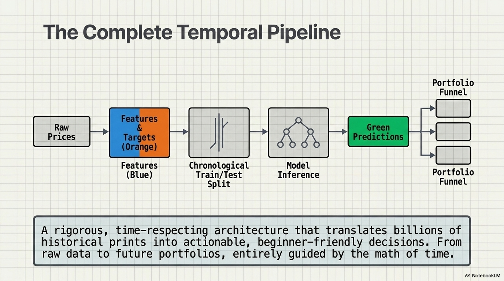
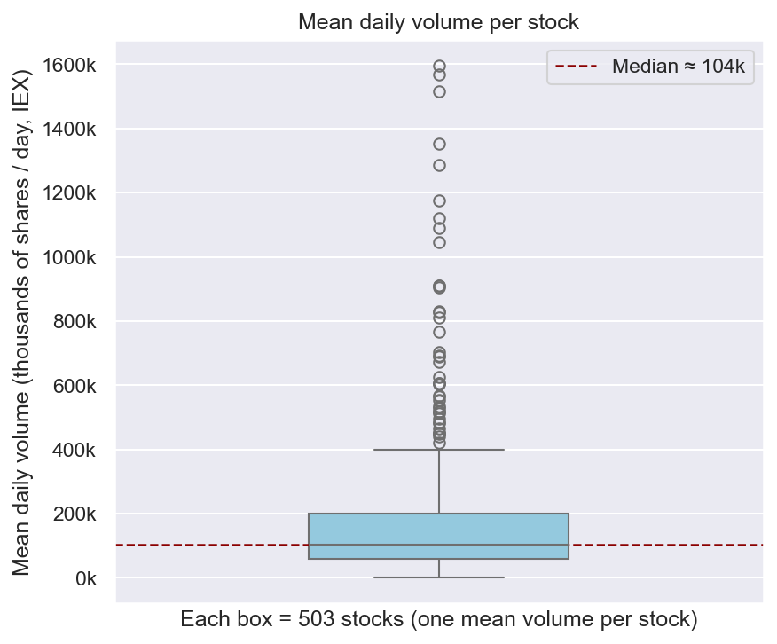
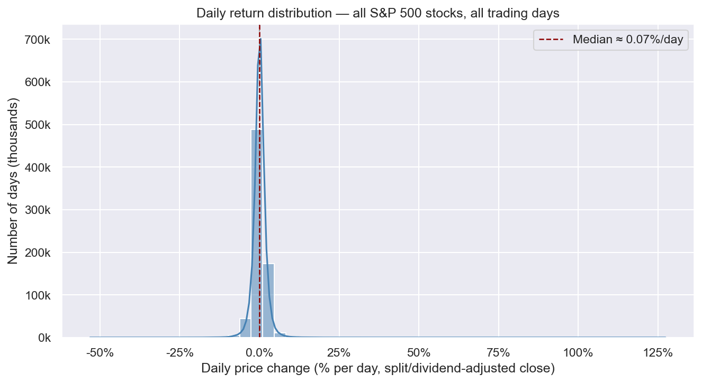
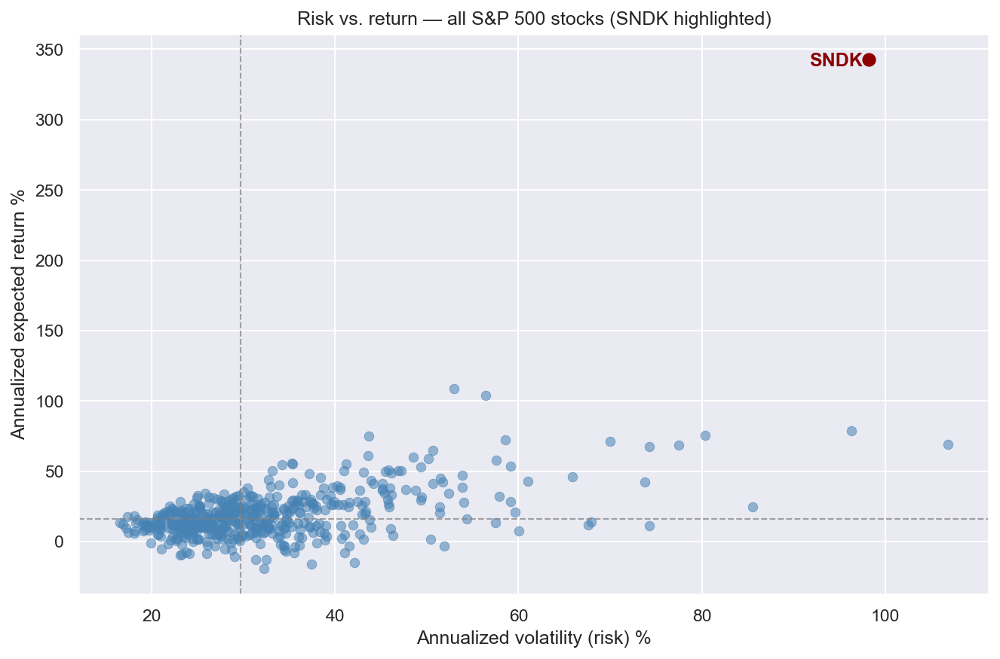
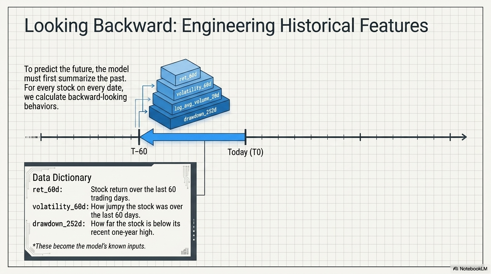
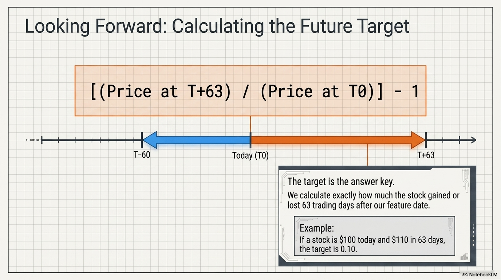
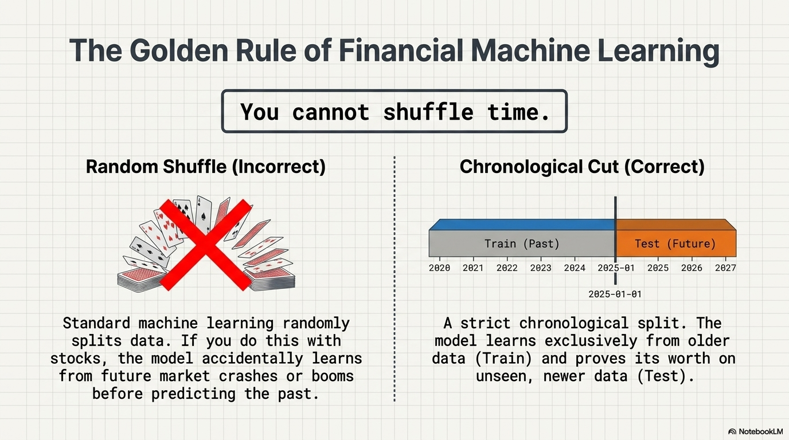
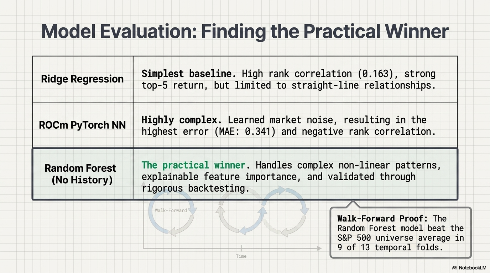
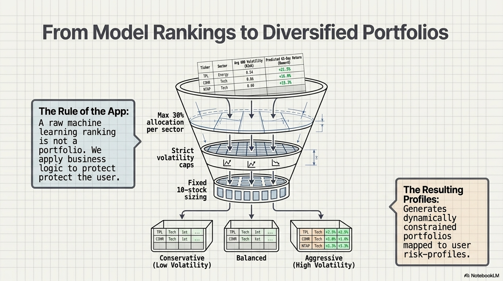

# Executive summary

This report freezes the **unified state** of the capstone project as of 2026-07-07 (branch
`two_merged_solutions` on the upstream repository; `main` on the working fork). The repository now
contains, side by side and without any loss of the original corpus:

- **Track B — the ranking recommender** (the project's original Stages 1–7): a cross-sectional
  regression experiment that ranks S&P 500 stocks by predicted 63-trading-day return and wraps the
  ranking in a questionnaire-driven, rule-based portfolio recommender.
- **Track A — the sealed per-asset pipelines**: two per-asset trading studies (XGBoost on 1-hour
  bars, LSTM on daily bars) built to a stricter standard — Triple-Barrier meta-labeling, purged and
  embargoed walk-forward validation, transaction costs, Kelly sizing, and a **one-shot**
  out-of-sample window (2024→2026) that is read exactly once per asset and never used to choose
  anything.
- **One unified Streamlit application** that presents both tracks under explicit **evidence
  tiers**, shares a single questionnaire→profile→portfolio-rule design across them, and blocks the
  one tempting shortcut that would have invalidated the whole exhibit (Section 7.2).

The scientific headline is deliberately honest. Track B shows a *weak but positive* exploratory
ranking signal (walk-forward rank correlation ≈ 0.06) under a lenient evaluation standard. Track A,
under the strict standard, reports a **negative result**: the strategy-v2 levers did not beat the
prior baseline over the full universe, and in the strong 2024→2026 bull window most per-asset
strategies do not beat simply buying and holding the same stock. We treat both verdicts as
first-class results: the demonstrated product is the *method* — leak-free labels, honest
validation, reproducibility — not a claim of market edge.

# The project at a glance

{ width=95% }

Two tracks answer **different questions** on the same universe:

| | **Track A — sealed pipelines** | **Track B — ranking recommender** |
|---|---|---|
| Question | Will *this specific proposed trade* net positive? | Which stocks rank best on 63-day forward return? |
| Unit of modeling | one model per asset (498 / 496 assets) | one cross-sectional model for all 503 |
| Label | Triple-Barrier (TP $2\times$ATR / SL $1\times$ATR), $Y=\mathbb{1}[\text{net}>0]$ | continuous forward 63-trading-day return |
| Models | XGBoost (1 h, multi-timeframe), LSTM (daily) | Ridge, RF, RF-no-history, XGBoost, PyTorch MLP |
| Validation | purged + embargoed walk-forward CV; **one-shot OOS 2024→2026** | fixed split + 13-fold walk-forward (no purge) |
| Costs / sizing | 1 bp fee + 2 bp slippage per side; generalized Kelly | gross returns; equal-weight top-N |
| Benchmark | per-asset buy & hold, same OOS window | universe average forward return per fold |
| Result status | realized, sealed, byte-reproducible | exploratory; package returns are predictions |

The merge that produced this state was performed with a **zero-loss gate**: all 1,159 paths of the
pre-merge `main` are present afterwards; the only content difference in the original corpus is one
appended appendix in `REPORT.md`. The original menu application, experiment folders
(`mac-2026-06-08/`, `mac-2026-06-09-full-6y/`), reports, figures, meeting notes and data producers
are intact.

# Data foundation

Two committed data planes serve the project:

- **Track B plane** — Alpaca Markets (free IEX feed) daily OHLCV for 503 current S&P 500
  constituents, 2020-07-27→2026-06-08 (≈ 726 k rows, 0 missing values after audit), with
  split/dividend-adjusted closes. Constituents come from Wikipedia; the yfinance alternative was
  rejected after a documented ~99.5 %-agreement audit.
- **Track A plane** — a committed daily DuckDB store (503 symbols, 2016→2026, **raw prices**:
  corporate actions deferred, so a split appears as a price cliff — every page that uses this store
  says so) plus a 1-hour bar store for the XGBoost pipeline (a 15-ticker demo subset ships in the
  repository; the full 1-hour store stays local).

The exploratory analysis below was mentor-validated in Rendering 1; each figure is backed by a live
statistical computation in the application's Data Explorer page.

{ width=78% }

{ width=60% }

{ width=82% }

{ width=80% }

# Track B — the ranking recommender (exploratory tier)

## Design

Track B predicts the **63-trading-day forward return** $r_{t,t+63} = P_{t+63}/P_t - 1$ (adjusted
close) for every stock-day, from nine backward-looking rolling features (returns, volatilities,
volume, drawdown) plus sector one-hots. Ranking, not level accuracy, is the goal.

{ width=88% }

{ width=88% }

{ width=88% }

## An honest leakage catch

The first Random Forest assigned importance 0.47 to `history_days` — the count of days a ticker had
existed in the dataset. That is a **listing-recency shortcut**, not a market signal: recent IPOs
happened to have specific return profiles in this window. The feature was diagnosed and removed;
all production variants are "no-history".

{ width=88% }

## Model comparison (fixed split)

| Model | MAE | RMSE | Spearman | Top-5 actual return | Universe avg |
|---|---|---|---|---|---|
| Ridge baseline | 0.134 | 0.203 | **0.164** | **0.343** | 0.043 |
| Random Forest (with history) | 0.135 | 0.207 | 0.083 | 0.216 | 0.043 |
| **RF without history_days** (production) | 0.135 | 0.205 | 0.110 | 0.301 | 0.043 |
| XGBoost without history_days | 0.137 | 0.210 | 0.060 | 0.179 | 0.043 |
| ROCm PyTorch MLP | 0.342 | 0.430 | −0.020 | 0.179 | 0.043 |

Ridge wins the fixed split; the production recommender still uses the no-history Random Forest for
its explainability (feature importances) and because it has a walk-forward validation run. The deep
model was **tested and honestly rejected** — extra complexity did not help ("the best model is not
always the most complex model").

{ width=90% }

**Walk-forward (RF no-history):** 13 expanding folds retrained every 63 trading days — mean
Spearman **0.062** (down from 0.164 on the fixed split: the in-project demonstration that single
splits flatter), mean top-5 actual return 18.2 % vs universe 4.7 %, top-5 beat the universe in
**9/13** folds.

## The portfolio layer

A deterministic rule turns rankings into risk-profiled packages: greedy top-down pick by the
selection objective, at most $\lfloor 10 \times 30\,\% \rfloor = 3$ names per sector, per-profile
annualized volatility caps (Conservative 0.35 / Balanced 0.50 / Aggressive 0.80), relax **only**
the volatility cap when underfilled, equal weights.

{ width=90% }

## What this tier does *not* claim

The exploratory badge on every Track B page states the limitations plainly:

1. **No purge/embargo** — the last ~63 training days' labels consume prices from inside each test
   window, so every walk-forward fold leaks at its boundary.
2. **Gross returns** — no commissions, slippage or position sizing.
3. **Overlapping horizons** — daily-sampled 63-day labels overlap ≈ 63×, so pooled rank
   correlations overstate the effective sample; 9/13 fold wins are not statistically significant at
   conventional levels.
4. **Model selection on the test split** — there is no untouched holdout on this track.
5. **Package "expected returns" are model predictions**, never realized or backtested numbers.

# Track A — the sealed per-asset pipelines (sealed tier)

## One procedure per asset

For each asset independently: a momentum side-signal behind a causal significant-move gate proposes
trades; an asymmetric **Triple-Barrier** label (take-profit $2\times$ATR$_{14}$, stop-loss
$1\times$ATR$_{14}$, time barrier $H{=}24$ hourly / $H{=}10$ daily bars) plus the cost model defines
$Y=\mathbb{1}[\text{net P\&L}>0]$; a per-asset model (XGBoost with causal 1 h/1 d/1 w
multi-timeframe features, or an LSTM over a 60-session window) predicts $P(Y{=}1)$; sizing is a
generalized fractional Kelly $f=\mathrm{clip}\!\left(\lambda\,(p - \tfrac{1-p}{b}),\,0,\,\text{cap}\right)$
with $b$ the barrier reward:risk (reduces exactly to the classical $\lambda(2p-1)$ at $b{=}1$).

Discipline, enforced in code and audited adversarially:

- **Purged + embargoed walk-forward CV** — training events whose barrier horizon crosses a fold
  boundary are dropped; an embargo gap follows every test fold (López de Prado).
- **Fold-causal normalization** — each fold's feature statistics use only data before its embargo
  boundary; the OOS window uses statistics frozen on the full train set.
- **Profit-aligned selection** — Optuna maximizes train out-of-fold trading **log-growth** (the
  Kelly-optimal criterion), not a proxy ranking metric.
- **One-shot OOS** — the 2024→2026 window is generated and scored exactly once per asset at the
  verdict step; fail-closed asserts in the HPO, the operating-point calibration and the feature
  search make it impossible for any OOS value to feed back into a decision.
- **Costs** — 1 bp commission + 2 bp slippage per side, mark-to-close equity, capital-depletion
  halt.
- **Determinism** — a re-run reproduces the sealed result rows byte-identically
  (`make verify-xgb`, `make verify-lstm`).

## Sealed full-universe results (read once, reported as-is)

| | **XGBoost (1 h)** | **LSTM (daily)** |
|---|---|---|
| Assets sealed | 498 | 496 |
| OOS window | 2024-01-02 → 2026-05-29 | 2024-01-02 → 2026-04-30 |
| Median profit factor | 0.57 | 0.96 |
| Median OOS return | +3.75 % | −0.00 % |
| Median trades per asset | 1 | 28 |
| Profitable assets | 298/498 | 248/496 |
| Beats own buy & hold | **64/498** | **144/496** |
| Median win rate | 52.2 % | 43.3 % |
| Median max drawdown | 26.8 % | 9.3 % |

Reading these numbers honestly:

- **The v2 strategy levers did not earn their keep.** Against its own earlier baseline the XGBoost
  v2 re-seal is clearly worse (median profit factor 0.87→0.57), and the LSTM is a wash. A small
  ~18-ticker development sample had flattered the levers; the full universe read once is the honest
  test — and it was committed transparently as a negative result.
- **The XGBoost median of 1 trade** is the asymmetric-barrier abstention effect: under the harder
  2:1 label most assets never clear the fixed entry threshold, so the strategy falls back to
  holding — the mean return (+32.4 %) is then mostly the bull market, not model skill. The
  application surfaces trade counts so a "package" of near-HODL rows cannot masquerade as an active
  strategy.
- **Buy & hold is the benchmark that matters** in a strong bull window — and most per-asset
  strategies do not beat it (XGBoost 64/498, LSTM 144/496). This comparison ships on the result
  page of every basket, not in a footnote.

# The evidence ladder

The single most important presentation rule in the unified project: **numbers from different
evidence tiers never share a results table.** A ranking-experiment return computed gross, without
purge, on overlapping labels is not the same object as a sealed, costed, one-shot OOS trading
return — placing them side by side would let the weaker number borrow the stronger number's
credibility. Every page of the application carries its tier badge (green "sealed" / amber
"exploratory"), and the report you are reading keeps the tracks in separate sections for the same
reason.

# The unified application

## Six pages, one design

`streamlit run app.py` (or `make app`) opens a single multi-page application — read-only over
committed artifacts, **nothing trains at runtime** (a defense requirement):

1. **Project Report** — the two-track narrative and the evidence ladder.
2. **Data Explorer** — the mentor-validated EDA (Section 3) recomputed live from the committed
   daily store, each plot with its statistical-validation expander.
3. **Risk Profile** — the original 9-question investor questionnaire, ported 1:1. An additive score
   over experience, horizon, loss tolerance, drawdown reaction and goal maps to Conservative
   (score ≤ −3) / Aggressive (≥ +3) / Balanced, plus portfolio size and sector exclusions.
4. **Recommender (Track B)** — the original recommendation page over the vendored ranking CSVs:
   preference controls prefilled from the questionnaire, the verbatim selection rule, model
   comparison, feature importances — under a permanent exploratory-tier badge.
5. **Basket Simulator (Track A)** — pick a model (XGBoost/LSTM) and a basket of tickers ($1,000
   each); the page replays the **sealed** one-shot OOS outcome of that basket against the same
   basket's buy & hold. New: **preset packages** (below).
6. **Methodology & Integrity** — the ladder in depth, the audit summary, and the limitations.

## The look-ahead trap, and the rule that avoids it

The obvious way to connect the tracks would have been to feed Track B's stock rankings into the
Track A simulator. That would be **look-ahead selection**: the production rankings are dated
2026-06-08 — the *end* of the sealed OOS window — so "selecting" tickers by them and then
displaying those tickers' sealed 2024→2026 results would quietly turn the demo into test-set
picking.

Instead, the preset packages port the *rule* and replace its inputs with quantities knowable
**before the OOS window opened**:

| Input | Pre-OOS source |
|---|---|
| Ranking score | `cv_auc_pr` — the train-CV score sealed in every result row (train ends 2023-12-29) |
| Volatility cap / momentum filter | recomputed from the committed daily store **as of 2023-12-29** (fail-closed generator refuses any later date) |
| Sector cap and exclusions | static GICS metadata |

The selection skeleton is the parent rule verbatim (greedy pick, ≤ 30 % per sector, volatility caps
0.35/0.50/0.80, relax-only-the-volatility-cap, equal weight); the three objectives become unit-free
z-score analogues because predicted returns cannot be used. The rule was fixed ex-ante in the
parent project and is never tuned against displayed outcomes; since the sealed rows were published
before the rule was ported, preset baskets are labeled an *illustration of a fixed rule*, not a new
out-of-sample claim.

## The preset packages, read honestly

Example packages for the XGBoost method under each profile's defaults ($1,000 per name, sealed OOS
window 2024-01-02→2026-05-29):

| Profile | Tickers (rank order) | Sectors | Sealed OOS | Same-basket buy & hold |
|---|---|---|---|---|
| Conservative | AAPL, MCO, AKAM, PTC, FDS, VLTO, COST, V, RSG, CTAS | 4 | **+1.24 %** | +8.67 % |
| Balanced | VLTO, MCO, PTC, CDNS, AAPL, COST, FDS, LULU, CTAS, MAR | 5 | **−2.24 %** | +3.40 % |
| Aggressive | VLTO, TSLA, LULU, ADSK, PTC, CDNS, MCO, EPAM, WST, COST | 7 | **−7.79 %** | +2.25 % |

Every package loses to its own buy & hold — exactly what Section 5.2's per-asset verdict predicts,
now visible at the portfolio level. The application shows this comparison on the result page rather
than hiding it; the monotone deterioration from Conservative to Aggressive is itself informative
(the volatility cap, computed pre-OOS, was doing real work).

## Engineering fixes shipped with the unification

- **XGBoost buy-&-hold feed re-sealed** — after the v2 re-seal the dashboard feed carried the
  benchmark for **0/498** assets, silently removing the honest comparison for the default method;
  it was recomputed with the LSTM feed's exact convention (first open → last close over the OOS
  window) from the committed daily store: 498/498.
- **Pre-OOS inputs table** with a fail-closed date assert (`tools/make_preoos_inputs.py`).
- **Zero-loss merge** of the unified branch with the current `main` (Section 2).
- **Robust root launcher** — `streamlit run app.py` works even when the `streamlit` binary on the
  operator's `PATH` belongs to a different environment (the repository venv's packages are appended
  as a fallback, host packages keeping priority).
- **Automated gates** (`make test-app`): pre-OOS date assert, package-rule determinism, sector/
  volatility-cap and relax-path checks, benchmark-feed consistency, and a scripted walk of every
  page including the full simulator flow.

## The Pipeline Blueprint — lessons learned, sealed as documentation

The build itself is documented by a **single-file HTML exhibit**
(`learning_by_doing_OHLCV_data_processing_pipeline.html`) embedded in the application as the
**Pipeline Blueprint** page. It renders Track A as a ladder of **17 procedure bricks** (bottom →
top = the data flow: S1 DATA → S2 SIGNAL+LABEL+FEATURES → S3 TRAINING → S4 OOS+PRODUCT, with a
fail-closed GUARDS lane), an **XGBoost (1h) | LSTM (daily)** switch that flips only the
model-specific bricks, and — per brick — the procedure contract plus a *HOW WE THOUGHT · WHAT WE
LEARNED* record. The brick order is welded by declaration: no drag & drop, no persistence — a
documentary, not an editor. The design goal is didactic: the most durable way to remember a
learning-by-doing build is to pin each lesson to the exact block where it was paid for.

**Lessons learned** (each anchored to its brick): optimize the criterion you deploy on — the HPO
objective moved from AUC-PR to Train-out-of-fold trading log-growth (C1); degrees of freedom are
earned — per-asset threshold calibration overfit and was pinned, the LSTM's joint calibration
validated and kept its freedom (C2); purge and embargo are not optional with horizon labels (A4,
G.1); an honest negative from a trustworthy method beats a positive from a leaky one (D1);
byte-identity replaces trust — reproduction gates guard even the honesty features themselves
(D2, G.3).

**Scalable thinking** — the transferable engineering patterns the blueprint encodes: one uniform
procedure per asset (scale by repetition, never special-casing); contracts with fail-closed gates
between stages; a registry entry per model (adding a method is one entry); one shared procedure
with per-model knob variants; the clone-and-show artifact strategy (seal results, demo data,
gitignore bulk); determinism designed in end-to-end.

**Algorithms in the data-science toolbox**, each shown in its block: gradient-boosted trees
(XGBoost) and recurrent networks (LSTM) as per-asset meta-labelers; Triple-Barrier labeling with
ATR-based geometry and purged + embargoed walk-forward cross-validation (López de Prado); Optuna
TPE hyper-parameter search with a profit-aligned objective; the generalized fractional Kelly
criterion $f=\mathrm{clip}(\lambda(p-\tfrac{1-p}{b}),0,\text{cap})$; forward feature selection
behind a seed-averaged noise gate; z-score-normalized selection objectives.

# Conclusions and limitations

## What the project demonstrates

1. **Method over outcome.** The sealed tier shows how to build a per-asset trading study whose
   number you can trust: causal labels, purged validation, costs, profit-aligned selection, an OOS
   window read once, and byte-level reproducibility. Its honest answer — *no edge demonstrated over
   buy & hold in this bull window* — is a feature of the method, not a failure of the project.
2. **A leakage catch in the wild.** Track B's `history_days` shortcut is a textbook example of a
   model exploiting dataset structure instead of markets, found and removed by inspecting feature
   importances.
3. **Single splits flatter.** Track B's rank correlation fell from 0.164 (fixed split) to 0.062
   (walk-forward) — the project's own data argues for the stricter standard.
4. **Tier separation is a design principle**, not a disclaimer: the same repository can honestly
   host an exploratory experiment and a sealed study if every number carries its evidential
   standard and the tempting cross-tier shortcuts are structurally blocked.

## Limitations we state rather than hide

- **Survivorship bias** — today's S&P 500 constituents applied backward; every "universe"
  benchmark is flattered. Acknowledged, not mitigated.
- **Raw prices in the Track A store** — corporate actions deferred; a split-crossing ticker's
  absolute numbers are path arithmetic, not economics (engine and benchmark share the store, so
  comparisons remain internally consistent).
- **IEX-only volumes** — a fraction of consolidated volume; fine for relative ranking.
- **A strong bull OOS window** — buy & hold is a hard benchmark in 2024→2026; the negative verdict
  is informative for this regime, not universal.
- **Future work** — the "discipline bridge": re-running the Track B ranking under Track A
  discipline (63-day purge, embargo, costs, the sealed OOS window, universe-HODL benchmark) would
  produce the one line honestly placeable next to the sealed baskets. Documented, not yet built.

# Reproducibility and provenance

```bash
make deps        # one virtualenv, pinned dependencies (CPU torch, xgboost, streamlit …)
make app         # the unified application on :8503   (equivalently: streamlit run app.py)
make test-app    # correctness gates + a scripted walk of every page
make verify-xgb  # re-run demo tickers from committed bars  == sealed rows, byte-identical
make verify-lstm # re-run a diverse sample from the manifest == sealed rows, byte-identical
```

- **Branches.** Working fork: `main` = `LSTM_XGB_DONE` (this state). Upstream
  (`DataScientest-Studio/apr26_bds_int_stock_portfolio`): branch `two_merged_solutions` carries the
  identical commit; the upstream `main` is untouched.
- **Corpus integrity.** The merge that produced this state passed a zero-loss gate (all 1,159
  pre-merge `main` paths present; the only corpus change is the appended Appendix F in
  `REPORT.md`).
- **Documents.** `docs/UNIFIED_APP.md` — the application design and tier rationale;
  `docs/PROJECT_STATE.md` — the sealed-tier handoff (audits, re-seal history);
  `reports/REPORT.md` — the team's growing final report (Rendering 1 + 2 + Appendix F);
  `reports/MODELING_REPORT_010726.md` — the frozen Rendering 2 modeling report.
- **This report** is a frozen milestone document; its tables were computed from the sealed stores
  (`xgb/data/oos_metrics.db`, `lstm/oos_metrics.db`, the committed benchmark feeds and the vendored
  Track B CSVs) on 2026-07-07 and will not drift because those artifacts are sealed.

> **Disclaimer.** This project is coursework: decision support built for a beginner investor
> persona, **not** financial advice. Every result in this report is historical, net of the stated
> assumptions, and specific to the studied window.
